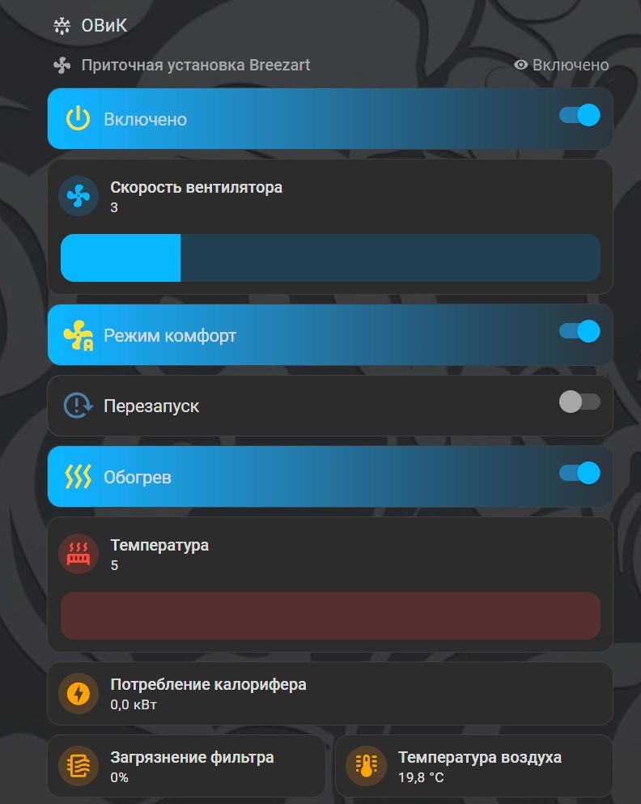

# Описание файла
Файл предназначен для чтения параметров вентиляционной установки Breezart и управления по протоколу TCP/IP.
В файле нужно указать IP вашей вент. установки и пароль для подключения.

## Название файла
`breezart_vent.py`

## Основные функции/классы
- `status`: получение информации о текущей работе вентиляционной установки
- `sensors`: получение информации с сенсоров установки (температура, влажность и т.п.)
- `fixed_params`: получение информации о фиксированных параметрах установки (мин. макс. температура и т.п.)
- `power`: включение / выключение установки
- `speed`: установка скорости работы вентилятора
- `temperature`: установка желаемой температуры нагрева воздуха
- `humidity`: установка желаемой влажности воздуха
- `set_feature`: установка параметров (режим комфорт, авто. старт и т.п.)

## Пример использования
Для получения статуса вентиляции выполните команду:
```bash
python3 /config/my_home/python_scripts/breezart_vent.py status
```
Пример вывода в консоль
```json
{
  "pwr_btn_state": true,
  "has_warning": false,
  "has_fatal_error": false,
  "danger_overheat": false,
  "auto_off": false,
  "change_filter": false,
  "mode_set": 2,
  "humid_mode": false,
  "speed_is_down": false,
  "func_restart": true,
  "func_comfort": true,
  "humid_auto": false,
  "scen_block": false,
  "btn_pwr_block": false,
  "unit_state": 1,
  "unit_state_str": "Включено",
  "power": true,
  "scen_allow": true,
  "mode": 0,
  "mode_str": "Обогрев",
  "num_active_scen": 0,
  "who_activate_scen": 0,
  "who_activate_scen_str": "Нет",
  "num_ico_hf": 0,
  "current_temp": 20,
  "target_temp": 5,
  "current_hum": 0,
  "target_hum": 50,
  "fan_speed": 3,
  "fan_speed_target": 3,
  "fan_speed_fact": 30,
  "temp_min": 5,
  "color_msg": 0,
  "color_msg_str": "Нормально",
  "color_ind": 2,
  "color_ind_str": "Включено",
  "filter_dust": 0,
  "minute": 48,
  "hour": 17,
  "day": 25,
  "month": 6,
  "dow": 3,
  "dow_str": "Ср",
  "year_short": 25,
  "msg": "Работа"
}
```
Включение установки, задание скорости и температуры:
```bash
python3 /config/my_home/python_scripts/breezart_vent.py power on
python3 /config/my_home/python_scripts/breezart_vent.py speed 3
python3 /config/my_home/python_scripts/breezart_vent.py temperature 15
```
В папке my_home лежат yaml примеры файлов для подключения к умному дому Home Assistant.
В файле configuration.yaml производиться импорт папок
```yaml
# Folders
automation: !include_dir_merge_list my_home/automations/
command_line: !include_dir_merge_list my_home/command_line/
input_number: !include_dir_merge_named my_home/input_number/
shell_command: !include_dir_merge_named my_home/shell_command/
```
